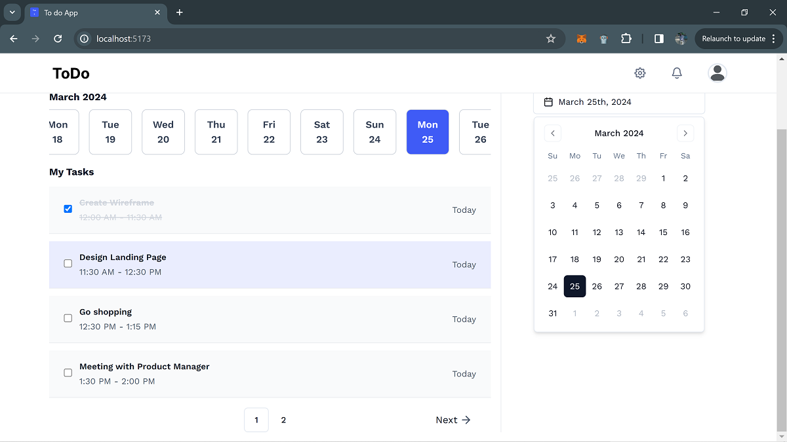
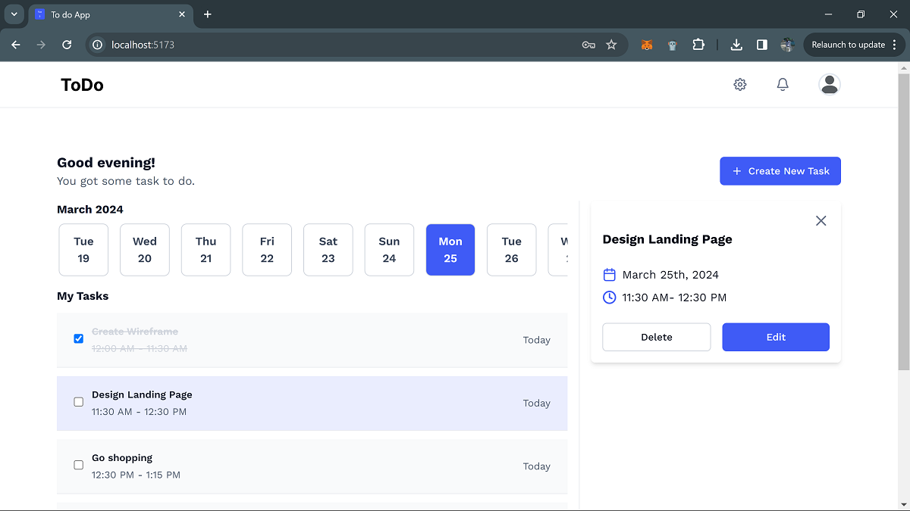
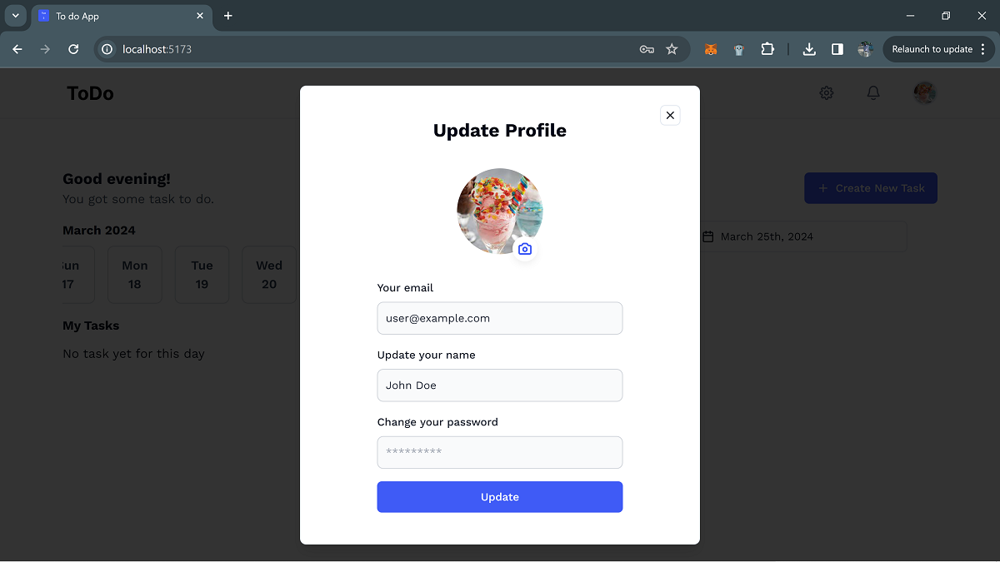
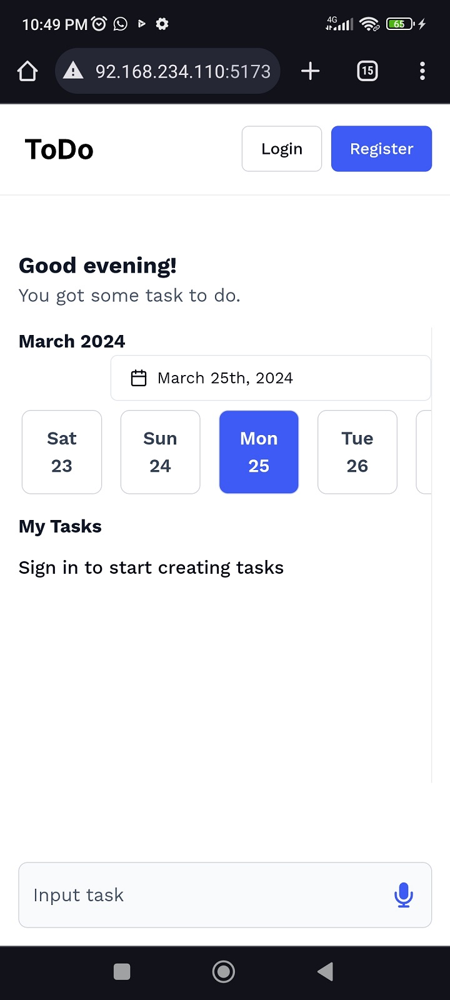
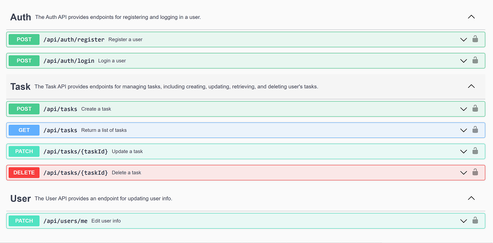

# Task Manager Application

This is a sample full stack application built using React and Nodejs. The application allows users to create tasks for a particular day, edit, update the task and task status and also delete tasks.

The project also includes a Swagger documentation.

## Table of contents

- [Overview](#overview)
  - [The challenge](#the-challenge)
  - [Screenshot](#screenshot)
  - [Links](#links)
- [My process](#my-process)
  - [Built with](#built-with)
- [Setting Up](#setup)
- [Documentation](#api-documentation)
- [Author](#author)

## Overview

### The challenge

The task is to seamlessly integrate the provided [figma design](https://www.figma.com/file/7j5ekdOJWPNOr41LwtPuJw/To-Do?type=design&node-id=0-1&mode=design&t=w3uNxXCuFws828Of-0), into a fully functional web application, demonstrating expertise in full stack web development and pixel-perfect implementation.

This Todo list should be web and mobile responsive

- Users should be able to add a todo
- Users should be able to edit a todo
- Users should be able to delete a todo
- Users should be able to see all todos
- All todos should be paginated

### Screenshot



###



###



###



### Links

- Live Site URL: (https://task-app-andemosa.vercel.app/)

## My process

### Built with

- TypeScript
- [React.js](https://react.dev/)
- [Tailwind](https://tailwindcss.com/)
- [ShadcnUI](https://ui.shadcn.com/)
- [Redux Toolkit](https://redux-toolkit.js.org/)
- [Express](https://expressjs.com/)
- [Zod](https://zod.dev/)

## Setup

This guide will walk you through the process of setting up the Task Manager App on your local machine.

### Prerequisites

Before you begin, ensure you have Node.js installed on your system.

### Cloning the Repository

Start by cloning the repository to your local machine:

```bash
git clone https://github.com/andemosa/task-app.git
cd task-app
```

### Backend Configuration

1. **Environment Files**: Navigate to the `server` folder and create an `.env` file using the `.env.example` file.

2. **MongoDB Setup**:

   - Sign up for an account at [MongoDB Atlas](https://www.mongodb.com/cloud/atlas).
   - Create a new cluster and follow the instructions to set up a new database.
   - Once set up, obtain your MongoDB connection string and add it to the `MONGODB_CONNECTION_STRING` variable in your `.env` files.
   - For the `.env.e2e` setup see "running automated tests" below

3. **JWT_SECRET_KEY**:
   - This just needs to be any long, random string. You can google "secret key generator".

### Frontend Configuration

1. **Environment Files**: Navigate to the `frontend` folder and create an `.env` file using the `.env.example` file.

2. **Cloudinary Setup**:

   - Create an account at [Cloudinary](https://cloudinary.com/).
   - Navigate to your settings and create a new preset.
   - Replace the placeholder `:cloud_name` with your username and `:action` with upload for the `VITE_UPLOAD_LINK`
   - Add your preset name as `VITE_UPLOAD_PRESET`.

3. **VITE_BASE_URLL**:
   - The `VITE_BASE_URL` should point to the URL where your backend application is running (typically `http://localhost:4000` if you're running it locally).

### Running the Application

1. **Backend**:

   - Navigate to the `server` directory.
   - Install dependencies: `yarn install`.
   - Start the server: `yarn dev`.

2. **Frontend**:
   - Open a new terminal and navigate to the `frontend` directory.
   - Install dependencies: `yarn install`.
   - Start the frontend application: `yarn dev`.
   - The application should now be running on `http://localhost:5173` but verify this in your command line terminal

## API Documentation

The REST API exposes its OpenAPI. You can view the API definition interactively using the Swagger UI, hosted at /docs. Simply start the server and navigate to [http://127.0.0.1:4000/docs](http://127.0.0.1:4000/docs) in your browser to access the Swagger UI.

Alternatively, you can explore the [online version of the API documentation](https://andemosa.github.io/task-app/) without running the server.

[](https://andemosa.github.io/task-app/)

## Author

- Anderson Osayerie - [@andemosa](https://andemosa.vercel.app)
- Twitter - [@andemosa](https://www.twitter.com/andemosa)
